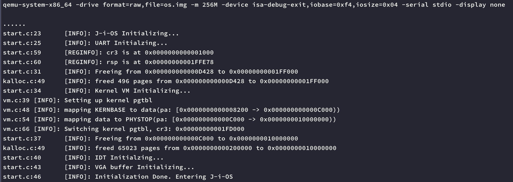

# J(i)OS
A 64 bit, amd64 compatible operating system from scratch.
The code contains a bootloader and a kernel. Currently kernel is able to allocate kernel heap memory.

Screenshot:

# Build and Run
## Prerequisite
You will need
    - qemu-system-x86_64
    - clang
    - ld.lld
    - nasm
    - (optional) clang-format
And thats it.

In kernel/Makefile, `LD` is set to `LD = /usr/local/Cellar/llvm/12.0.1/bin/ld.lld`
Use your path instead.

## Build and Run
After the preparation, under `some-path/J-i-OS`, run `make test` to run the O/S and get the output from stdout.

Or, run `make qemu` to run the O/S with a vga buffer, I DO NOT recommend this since all logging and output
are currently through uart to stdout.

Run `make format` to format the codes in GNU style.

# Directory
boot -> bootloader, from real mode -> protected mode -> long mode (heavily borrowed from osdev.org)
kernel -> kernel code, style like xv6 (MIT 6.828)

# Run
make qemu:
    run in qemu, with display

make test:
    without display, uart output redirected to stdout

make img:
    build os.img from bootloader and kernel code

# Kernel code size tip
The formation of os.img is as follows.
    - 1. use nasm to assemble the bootloader in to a binary.
    - 2. use gcc to compile the C kernel code (*.o files), also use nasm to compile kernel assembly to elf64
    - 3. use ld and linker script to link the kernel codes.
    - 4. use ld to dump the elf64 file to binary file
    - 5. use cat to concatenate the bootloader and kernel binary to form os.img

The kernel the sectors after 0x7c00 - 0x7e00 needs to explicitly read by bios interrupt.
Therefore, we have to specify the code size in boot.S, let the real mode bios interrupt read correct # of sectors
into memory in advance.

The procedure is as follows.
    - 1. use `make sz` to output the size of image(in byte)
    - 2. divide this # by 512(sector size), use the integer below it.
    - 3. change the cx register to this number in boot.S, before the call of disk_load

# Roadmap
[x] bootloader
[x] jump to C kernel
[x] bigger kernel
[x] VGA and uart
[x] setup idt
   - [x] sample breakpoint interrupt
   - [x] remap pic
   - [x] keyboard interrupt
   - [x] timer interrupt
[x] logger
   - [x] printf
   - [x] logging w/ file name & line number
[x] kernel memory allocation
   - [x] mmu
[x] switch kernel pgtbl when entered C
   - [x] page table walk
   - [x] page table setup and write to cr3
[] process
[] scheduling
[] user space
[] trap
[] filesystem
   - [] inode
   - [] initramfs
   - [] image file system

Ji Xinyou

# Acknowledgement
I write this OS project mainly for 2 reasons. First is for my personal interest on the bottom-up process
of a freestanding operating system. Second is to leave the git log for everyone looking at this repository, 
to check the developement process of this OS, most commit is bug-free, and being commented relatively clear.
During the development, I reference many tutorials and websites, including youtube tutorial by @Poncho, stackoverflow
questions, osdev wiki and github repo 64bit-os-tutorial, also borrowed some codes from xv6. I am here to thank every 
person that help me through the development by any means.

If you have found any bug or have any questions, please feel free to issue them in the github issue section, or
email me straight to jerryji0414[at]outlook[dot]com.
